# cpp_class

## 异常类

### 标准的Exception Class
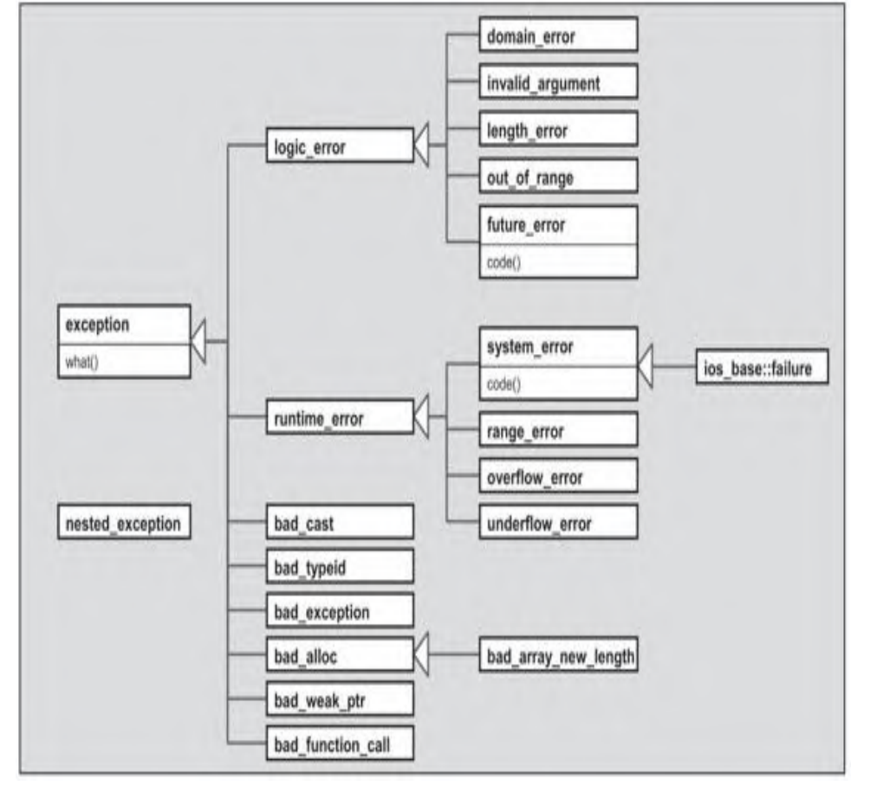

#### logic_error

##### domain_error

##### invalid_argument

##### length_error

##### out_of_range

##### future_error

#### runtime_error

##### system_error

###### ios_base::falture

##### range_error

##### overflow_error

##### underflow_error

#### bad_cast

#### bad_typeid

#### bad_exception

#### bad_alloc

##### bad_array_new_length

#### bad_weak_ptr

#### bad_function_call

## pair

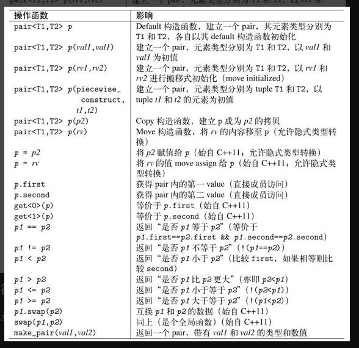

    make_pair
        如果make_pair里面的参数想要是是引用，那么需要使用ref和cref转成引用
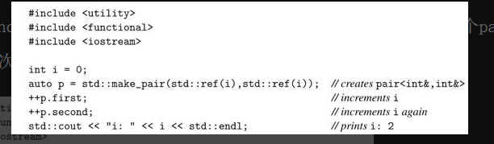

    pair 对象之间比较，如果两个pair对象内的所有元素都相等，则zhe'lzheli'ang'iangg额对象被视为相等
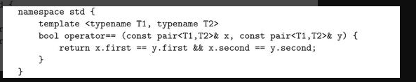

## tuple
    tuple可以接受任何数量template实参
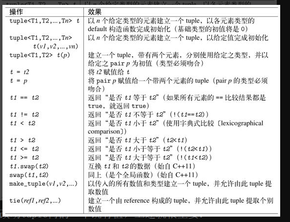

    tie
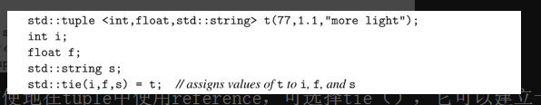

    这里的std：：tie（i，f，s）会以i、f和s的reference建立起一个tuple，因此上述赋值操作其实就是将t内的元素分别赋值为Ti、f和s。
    使用tie（）时，std::ignore允许我们忽略tuple的某些元素，也就是我们可以用它来局部提取tuple的元素值：
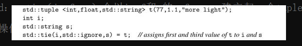
std::ignore忽视某一个元素

    tuple不能进行隐式转换
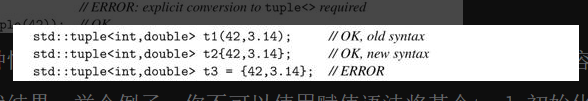

    此外，你不可以将初值列传至“期望获得一个tuple”的地方
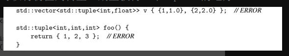
    
    注意，上述做法对于pair＜＞和容器（除了array＜＞）是行得通的
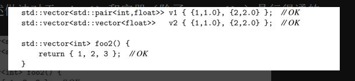
    
    但对于tuple，你必须明确地将初值转为一个tuple（如运用make_tuple（））：
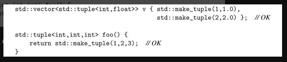

    tuple_size＜tupletype＞：：value可获得元素个数。
    tuple_element＜idx，tupletype＞：：type可取得第idx个元素的类型（也就是get（）返回值的类型）。
    tuple_cat（）可将多个tuple串接成一个tuple。
    std::get<0>(tuple): 获取tuple内的元素
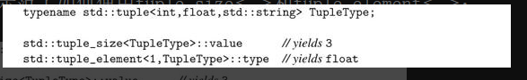

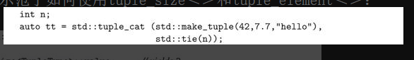
    这里的tt成为一个tuple，拥有众多tuple的所有元素，即便最后的元素n是个引用。

## smart_poiter
    共享式智能指针，多个shared_ptr可以指向同一个对象，该对象和资源会在最后一个shared_ptr被销毁时被释放
    shared_ptr的构造函数是explicit，禁止隐式类型转换

### shared_ptr
    共享式智能指针，多个shared_ptr可以指向同一个对象，该对象和资源会在最后一个shared_ptr被销毁时被释放
    shared_ptr的构造函数是explicit，禁止隐式类型转换,被赋值会报错，可以用reset
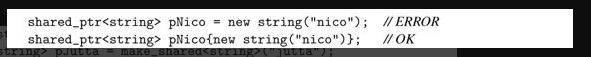

    make_shared：创建智能指针对象

    shared_ptr指向array（数组）对象是错误的，shared_ptr提供的default调用的是delete，delete[]，所以shared_ptr不能释放数组
    所以，如果你使用new[]建立一个array of object，你必须定义你自己的deleter。这很简单，你可以传递一个函数、函数对象或lambda，让它们针对传入的寻常指针调用delete[]。例如
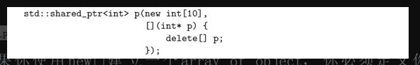

    也可以使用为 unique_ptr而提供的辅助函数（见5.2.5节第106页）作为deleter，其内调用delete[]：

#### weak_ptr

#### bad_weak_ptr

#### enable_shared_from_this

### unique_ptr

## 辅助函数
    

